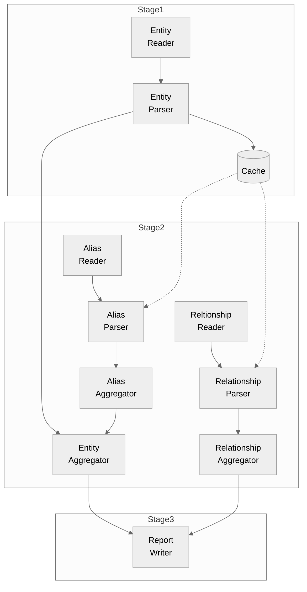

# mermaid-test
Testing Mermaid

```mermaid
%%{init: {'theme':'neutral'}}%%
flowchart TD
    subgraph Stage1
    G[Entity\nReader]
    I[Entity\nParser]
    J[(Cache)]
    end

    subgraph Stage2
    F[Alias\nReader]
    K[Alias\nParser]
    C[Alias\nAggregator]

    E[Reltionship\nReader]
    H[Relationship\nParser]
    B[Relationship\nAggregator]
    D[Entity\nAggregator]
    end

    subgraph Stage3
    A[Report\nWriter]
    end

    G --> I
    I --> J
    I ------> D
    E --> H
    H --> B
    F --> K
    K --> C
    D --> A
    J -.-> K
    J -.-> H
    B --> A
    C --> D

```
